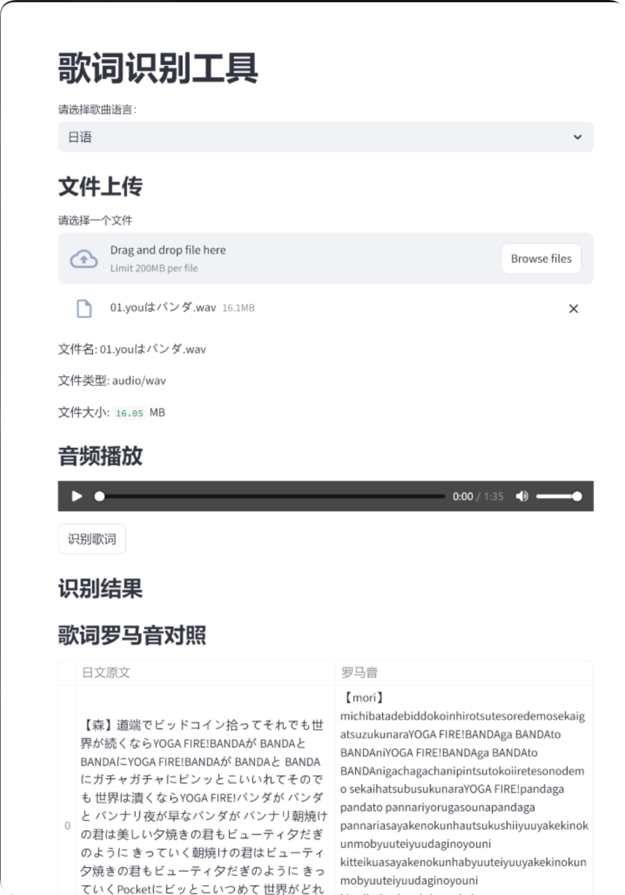
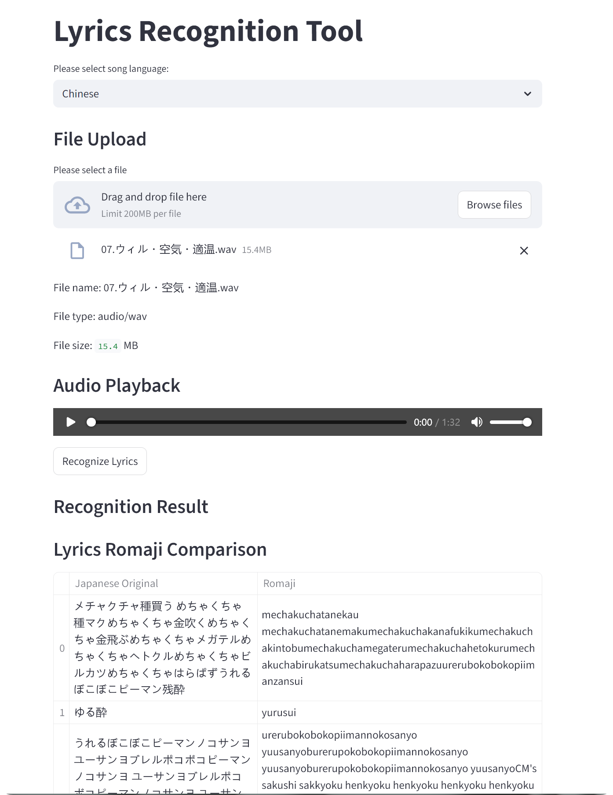

# 歌词识别工具 (Lyrics Recognition Tool)

<div align="center">
    
    <br>
    <br>
    <a href="https://github.com/choko-oni/Audio2Lyrics" target="_blank">
        
    </a>
    <a href="https://github.com/choko-oni/Audio2Lyrics/issues" target="_blank">
        
    </a>
    <a href="https://github.com/choko-oni/Audio2Lyrics/blob/main/LICENSE" target="_blank">
        
    </a>
    <br>
    <br>
    <div style="display: flex; justify-content: center; gap: 10px;">
        <a href="#zh" style="text-decoration: none; color: #007bff; font-weight: bold;">中文</a>
        <span>|</span>
        <a href="#en" style="text-decoration: none; color: #666;">English</a>
        <span>|</span>
        <a href="#ja" style="text-decoration: none; color: #666;">Japanese</a>
    </div>
</div>

## <a name="zh"></a> 📄 项目介绍

🎵 这是一个基于python3的歌词识别工具，音频解析基于FFmpeg，语音识别基于openAI-Whisper模型，UI框架使用了Streamlit，支持将音频文件中的歌词识别出来，并可选择转换为罗马音进行对照查看。

🔍 如果你恰好需要一个基于python3的歌词识别工具，这个项目可能会满足你的需求。
💬 如果这个项目暂时不能满足你的需求，欢迎提交issue，我会尽快进行更新。
🤝 我也很期待你能够参与到这个项目的开发中来，为这个项目贡献你的力量。
⭐ 如果这个项目对你有帮助，请给我一颗star，谢谢！

## ✨ 功能特点

- 🌐 **语言选择**：支持中文、英文和日语
- 📁 **文件上传**：支持上传本地音频文件
- 🎧 **音频播放**：内置音频播放器，可预览音频内容
- 🎤 **歌词识别**：使用Whisper模型进行歌词识别
- 🔤 **罗马音转换**：支持将日语歌词转换为罗马音
- 📊 **对照显示**：以表格形式显示原歌词和罗马音对照

## 🚀 安装步骤

1. 📥 克隆或下载本项目到本地
2. 📦 安装所需依赖：
   ```bash
   pip install streamlit whisper pykakasi
   ```
3. 🔧 确保已安装FFmpeg并配置到环境变量
4. 🚀 运行应用：
   ```bash
   streamlit run app.py
   ```

## 📖 使用方法

1. 🌐 在浏览器中打开应用（默认地址：http://localhost:8501）
2. 🔽 在"请选择歌曲语言"下拉框中选择音频文件的语言
3. 📁 点击"请选择一个文件"按钮，上传要识别歌词的音频文件
4. 🎧 使用音频播放控件预览音频内容
5. 🎯 点击"识别歌词"按钮，等待识别完成
6. 📝 识别完成后，会显示识别出的歌词
7. 🔄 识别完成后会自动出现日语歌词和罗马音的对照表格

## 🛠️ 技术实现

- 🖥️ **前端**：Streamlit
- 🐍 **后端**：Python
- 🎵 **音频处理**：FFmpeg
- 🤖 **模型**：Whisper (用于语音识别)
- 🔤 **罗马音转换**：pykakasi

## ⚠️ 注意事项

- 🎯 识别精度取决于音频质量和清晰度
- ⏱️ 对于较长的音频文件，识别时间可能会较长
- 🔤 罗马音转换仅对日语歌词有效

## 📸 示例效果


## 📄 许可证

📜 本项目采用MIT许可证。

## 🌟 贡献

🤝 欢迎提交Issue和Pull Request来改进这个项目！

---

## <a name="en"></a> 📄 Project Introduction

🎵 This is a lyrics recognition tool based on Python 3. Audio analysis relies on FFmpeg, speech recognition is powered by the OpenAI-Whisper model, and the UI framework is built with Streamlit. It can recognize lyrics from audio files, and supports converting the recognized lyrics into Romanized Japanese for side-by-side viewing.

🔍 If this project cannot meet your requirements for the time being, feel free to submit an issue and I will update it as soon as possible.
🤝 I also sincerely hope that you can participate in the development of this project and contribute your part to it.
⭐ If this project has been helpful to you, please give it a star. Thank you!

## ✨ Features

- 🌐 **Language Selection**：Supports Chinese, English, and Japanese
- 📁 **File Upload**：Supports uploading local audio files
- 🎧 **Audio Playback**：Built-in audio player for previewing audio content
- 🎤 **Lyrics Recognition**：Uses Whisper model for lyrics recognition
- 🔤 **Romaji Conversion**：Supports converting Japanese lyrics to romaji
- 📊 **Comparison Display**：Displays original lyrics and romaji in a table format

## 🚀 Installation Steps

1. 📥 Clone or download this project to your local machine
2. 📦 Install required dependencies:
   ```bash
   pip install streamlit whisper pykakasi
   ```
3. 🔧 Ensure FFmpeg is installed and configured in environment variables
4. 🚀 Run the application:
   ```bash
   streamlit run app.py
   ```

## 📖 Usage

1. 🌐 Open the application in your browser (default address: http://localhost:8501)
2. 🔽 Select the language of the audio file in the "请选择歌曲语言" (Please select song language) dropdown
3. 📁 Click the "请选择一个文件" (Please select a file) button to upload the audio file for lyrics recognition
4. 🎧 Use the audio playback control to preview the audio content
5. 🎯 Click the "识别歌词" (Recognize Lyrics) button and wait for the recognition to complete
6. 📝 After recognition, the recognized lyrics will be displayed
7. 🔄 Convert done you can view the comparison table of lyrics and romaji

## 🛠️ Technical Implementation

- 🖥️ **Frontend**：Streamlit
- 🐍 **Backend**：Python
- 🎵 **Audio Processing**：FFmpeg
- 🤖 **Model**：Whisper (for speech recognition)
- 🔤 **Romaji Conversion**：pykakasi

## ⚠️ Notes

- 🎯 Recognition accuracy depends on audio quality and clarity
- ⏱️ For longer audio files, recognition time may be longer
- 🔤 Romaji conversion only works for Japanese lyrics

## 📸 Example Effect



## 📄 License

📜 This project is licensed under the MIT License.

## 🌟 Contributing

🤝 Contributions are welcome! Please feel free to submit issues and pull requests to improve this project.

---

## <a name="ja"></a> 📄 プロジェクト紹介

🎵 これはPython 3ベースの歌詞認識ツールです。音声解析にはFFmpegを使用し、音声認識にはOpenAI-Whisperモデルを使用し、UIフレームワークにはStreamlitを使用しています。オーディオファイルから歌詞を認識し、ローマ字に変換して並べて表示することができます。

🔍 もしあなたがPython 3ベースの歌詞認識ツールを必要としているなら、このプロジェクトがあなたの要件を満たすかもしれません。
💬 もしこのプロジェクトが暫くの間あなたの要件を満たすことができない場合は、issueを提出してください。できるだけ早く更新します。
🤝 また、このプロジェクトの開発に参加して、あなたの力を貢献していただけることを心から期待しています。
⭐ もしこのプロジェクトがあなたの役に立ったら、スターを付けてください。ありがとうございます！

## ✨ 機能

- 🌐 **言語選択**：中国語、英語、日本語に対応
- 📁 **ファイルアップロード**：ローカルオーディオファイルのアップロードに対応
- 🎧 **オーディオ再生**：オーディオコンテンツをプレビューするための組み込みオーディオプレーヤー
- 🎤 **歌詞認識**：Whisperモデルを使用した歌詞認識
- 🔤 **ローマ字変換**：日本語の歌詞をローマ字に変換する機能
- 📊 **比較表示**：元の歌詞とローマ字を表形式で表示

## 🚀 インストール手順

1. 📥 このプロジェクトをローカルマシンにクローンまたはダウンロードします
2. 📦 必要な依存関係をインストールします：
   ```bash
   pip install streamlit whisper pykakasi
   ```
3. 🔧 FFmpegがインストールされ、環境変数に設定されていることを確認します
4. 🚀 アプリケーションを実行します：
   ```bash
   streamlit run app.py
   ```

## 📖 使用方法

1. 🌐 ブラウザでアプリケーションを開きます（デフォルトアドレス：http://localhost:8501）
2. 🔽 「曲の言語を選択してください」ドロップダウンからオーディオファイルの言語を選択します
3. 📁 「ファイルを選択してください」ボタンをクリックして、歌詞を認識するオーディオファイルをアップロードします
4. 🎧 オーディオ再生コントロールを使用してオーディオコンテンツをプレビューします
5. 🎯 「歌詞を認識」ボタンをクリックして、認識が完了するのを待ちます
6. 📝 認識が完了すると、認識された歌詞が表示されます
7. 🔄 変換が完了すると、歌詞とローマ字の比較表を表示できます

## 🛠️ 技術実装

- 🖥️ **フロントエンド**：Streamlit
- 🐍 **バックエンド**：Python
- 🎵 **音声処理**：FFmpeg
- 🤖 **モデル**：Whisper（音声認識用）
- 🔤 **ローマ字変換**：pykakasi

## ⚠️ 注意事項

- 🎯 認識精度は音声の品質と明瞭さに依存します
- ⏱️ 長いオーディオファイルの場合、認識に時間がかかることがあります
- 🔤 ローマ字変換は日本語の歌詞にのみ有効です

## 📸 例の効果


## 📄 ライセンス

📜 このプロジェクトはMITライセンスの下でライセンスされています。

## 🌟 貢献

🤝 貢献は大歓迎です！このプロジェクトを改善するために、issueやpull requestを自由に提出してください。
